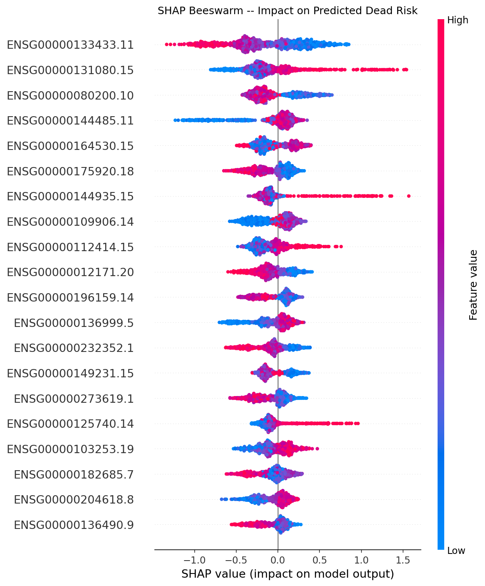

# Multi-Omics Cancer Biomarker Discovery

### Predicting Vital Status from TCGA-BRCA RNA-Seq Expression Data


A production-grade, end-to-end machine learning pipeline that ingests raw RNA-Seq expression data, performs leakage-free preprocessing and biomarker panel selection, trains an interpretable stacking ensemble, and serves predictions through a FastAPI microservice — built with the OOP discipline, defensive serialization, and CI-ready tooling expected of a production data science team, not a one-off notebook.

**Stack:** Python 3.11 · scikit-learn · XGBoost · SHAP · FastAPI · Pydantic · joblib

---

## Table of Contents

- [Overview](#overview)
- [Key Engineering Highlights](#key-engineering-highlights)
- [Pipeline Architecture](#pipeline-architecture)
- [Model Performance](#model-performance)
- [Biological Insights & Explainability](#biological-insights--explainability)
- [Project Structure](#project-structure)
- [Quick Start](#quick-start)
- [Known Limitations & Future Work](#known-limitations--future-work)

---

## Overview

**Goal:** predict binary vital status (*Alive* vs. *Dead*) for breast cancer patients directly from RNA-Seq gene expression, and identify the genes driving that prediction.

**Data sources:**
- **Expression:** TCGA-BRCA RNA-Seq, FPKM-UQ normalized (GDC Hub, UCSC Xena) — ~60,660 raw gene features.
- **Clinical labels:** TCGA-BRCA GDC Hub phenotype data (`TCGA-BRCA.GDC_phenotype.tsv.gz`), with the vital-status label column (`vital_status.demographic`) detected dynamically at ingestion time and aligned against the GDC expression matrix on trimmed sample barcodes.

This is framed deliberately as a **classification** problem, not a full survival analysis — see [Known Limitations](#known-limitations--future-work) for what that trade-off means and how to close it.

---

## Key Engineering Highlights

- **Custom, sklearn-native transformers.** `Log2FPKMTransformer`, `LowExpressionFilter`, and `MADFilter` are hand-built `BaseEstimator`/`TransformerMixin` subclasses — not `FunctionTransformer` wrappers — because they carry genuine fit-time state (learned masks) that must be replayed identically on unseen data. Fully compatible with `Pipeline`, `cross_val_score`, and `GridSearchCV` out of the box.
- **Leakage-free by construction.** Every learned statistic — expression masks, variance thresholds, `StandardScaler` parameters, ANOVA F-scores, the MAD ranking — is fit exclusively on the training split and never recomputed on held-out data.
- **Memory-optimized for constrained hardware.** Engineered against an Intel i7-1360P (integrated graphics, no discrete GPU): `float64 → float32` downcasting, two-pass file reads (header inspection before full allocation), explicit `gc.collect()` staging between large allocations, and a `MemoryReporter` utility instrumenting every pipeline stage.
- **Production-grade API layer.** FastAPI with `lifespan`-managed artifact loading (fail-fast on a bad model at startup, not mid-request), full Pydantic request/response validation, and synchronous endpoints correctly left as `def` rather than `async def` so CPU-bound sklearn/XGBoost inference is offloaded to Starlette's threadpool instead of blocking the event loop.
- **A real production bug, found and fixed.** See below.

### The Pickle Trap: A Real Production Bug

`joblib`/`pickle` doesn't serialize a class's code — it stores `(module_name, qualname)` and reconstructs the class via `getattr(import_module(module_name), qualname)`. When a script defining a custom class is executed *directly* (`python src/feature_selection.py`), Python sets that script's `__name__` to `"__main__"` for the duration of the run — so the class gets pickled under module `"__main__"`, not its real dotted path. Any other script that later tries to unpickle that artifact — with a *different* file now occupying the `__main__` slot — fails with `AttributeError: Can't get attribute 'X' on <module '__main__' ...>`.

This surfaced during real development as different scripts became the active entry point. It's fixed at the root rather than patched around: every custom class has its `__module__` explicitly pinned immediately after definition —

```python
MADFilter.__module__ = "src.feature_selection"
```

— so the correct pickling identity holds regardless of how the file is ever executed, closing the issue permanently rather than relying on reactive `try/except` recovery at every load site.

---

## Pipeline Architecture

```
Raw Expression (60,660 genes)
        |  Log2(FPKM+1) -> low-expression filter -> VarianceThreshold -> StandardScaler
        v
Preprocessed (~5,658 genes)
        |  MADFilter (robust, unsupervised)
        v
MAD-filtered (2,000 genes)
        |  SelectKBest (ANOVA F-test, supervised)
        v
Biomarker Panel (100 genes)
        |  StackingClassifier: RandomForest + XGBoost -> LogisticRegression
        v
BiomarkerEnsemble  ------->  BiomarkerSHAPExplainer  ------->  FastAPI /predict
```

| Stage | Module | Responsibility |
|---|---|---|
| Ingestion | `src/data_ingestion.py` | Memory-optimized ETL from GDC Hub expression + phenotype files (`TCGA-BRCA.htseq_fpkm-uq.tsv.gz`, `TCGA-BRCA.GDC_phenotype.tsv.gz`); dynamic label-column detection; barcode-truncation-aware index alignment |
| Preprocessing | `src/preprocessing.py` | 4-stage `GenomicsPreprocessor` Pipeline: log2 transform, low-expression filtering, variance thresholding, scaling |
| Feature Selection | `src/feature_selection.py` | 2-stage `GenomicsFeatureSelector`: MAD pre-filter -> supervised `SelectKBest` |
| Modeling | `src/models/ensemble_model.py` | `BiomarkerEnsemble`: RF + XGBoost stacking ensemble with a `LogisticRegression` meta-learner, data-driven `scale_pos_weight` for class imbalance |
| Explainability | `src/explainability/shap_explainer.py` | `BiomarkerSHAPExplainer`: exact Tree SHAP on the XGBoost base learner, signed toward the positive (*Dead*) class |
| Deployment | `src/api/main.py` | FastAPI service, `lifespan`-managed artifact loading, Pydantic-validated `/predict` endpoint |

---

## Model Performance

Evaluated on a held-out, stratified 20% test split — never seen during preprocessing, feature selection, or training:

| Metric | Score | Interpretation |
|---|---|---|
| **ROC-AUC** | 0.6243 | Modest but real discriminative signal — above the 0.50 no-skill baseline, well below clinical-grade |
| **PR-AUC** | 0.3102 | More informative than ROC-AUC under class imbalance; read relative to the positive-class prevalence in your split |
| **Macro-F1** | 0.5654 | Equal weight to both classes regardless of class size |

**Reading these numbers honestly:** raw vital-status classification from expression alone, without accounting for follow-up duration, is a genuinely harder and noisier target than a cleaner molecular endpoint (e.g., PAM50 subtype). These metrics are presented as a defensible baseline for a hypothesis-generating biomarker panel — not a claim of clinical predictive performance. See [Known Limitations](#known-limitations--future-work) for what would meaningfully move this number.

---

## Biological Insights & Explainability

Accuracy alone doesn't answer *why*. `BiomarkerSHAPExplainer` runs exact Tree SHAP (`shap.TreeExplainer`) on the ensemble's XGBoost base learner, producing a beeswarm plot, a mean-\|SHAP\| bar chart, and a signed, ranked biomarker table (`reports/shap_biomarker_table.csv`).

**Top biomarker by both Random Forest importance and SHAP: GSTT2B** (`ENSG00000133433`)

GSTT2B (glutathione S-transferase theta 2B) is a Phase II detoxification enzyme in the glutathione S-transferase family. GSTT1/GSTT2/GSTT2B conjugate glutathione to electrophilic and hydrophobic compounds — including many chemotherapy agents — and the family has documented associations with carcinogenesis in the literature.

Two independent ranking methods converge on the same gene: GSTT2B ranks #1 by Random Forest Gini importance, and independently ranks #1 by mean \|SHAP\| value on the XGBoost base learner. SHAP additionally recovers *direction*, which Gini importance cannot — a negative mean signed SHAP value indicates that GSTT2B's presence in the model reduces predicted mortality risk on average across the cohort: an inverse, protective association between expression and predicted Dead-risk, consistent with elevated glutathione-conjugation activity supporting more effective clearance of cytotoxic compounds.

| Gene | Ensembl ID | Selection Method | Mean \|SHAP\| | Mean SHAP (signed) | Direction |
|---|---|---|---|---|---|
| GSTT2B | ENSG00000133433 | RF Gini importance + SHAP (rank #1 by both) | 0.3835 | -0.1319 | Protective (pushes toward *Alive*) |



---

## Project Structure

```
multi-omics-biomarker/
├── src/
│   ├── data_ingestion.py          # TCGA-BRCA GDC Hub expression + phenotype ETL
│   ├── preprocessing.py           # Log2 transform -> filter -> variance -> scale
│   ├── feature_selection.py       # MADFilter -> SelectKBest, leakage-free
│   ├── models/
│   │   └── ensemble_model.py      # BiomarkerEnsemble: RF + XGBoost stack
│   ├── explainability/
│   │   └── shap_explainer.py      # BiomarkerSHAPExplainer: TreeExplainer
│   └── api/
│       └── main.py                # FastAPI service, lifespan-managed
├── models/                        # Serialized .joblib artifacts (gitignored)
├── reports/
│   └── figures/                   # Generated SHAP plots
├── data/
│   └── raw/                       # Place downloaded Xena files here (gitignored)
├── test_api.py                    # Standalone live-server smoke test
├── requirements.txt
├── requirements-dev.txt
└── README.md
```

---

## Quick Start

### 1. Environment

```bash
git clone <your-repo-url>
cd multi-omics-biomarker
python -m venv .venv
source .venv/bin/activate        # Windows: .venv\Scripts\activate

pip install --upgrade pip
pip install -r requirements.txt
pip install -r requirements-dev.txt
pre-commit install
```

### 2. Data

Download into `data/raw/` from the [UCSC Xena Browser](https://xenabrowser.net/datapages/) (GDC Hub -> TCGA Breast Cancer (BRCA)):
- `TCGA-BRCA.htseq_fpkm-uq.tsv.gz` — RNA-Seq expression, FPKM-UQ normalized
- `TCGA-BRCA.GDC_phenotype.tsv.gz` — clinical/phenotype data, including `vital_status.demographic`

### 3. Train the pipeline

Each script is independently runnable and will load or fit upstream artifacts as needed:

```bash
python src/preprocessing.py                       # ingestion + preprocessing
python src/feature_selection.py                    # 100-gene biomarker panel
python src/models/ensemble_model.py                 # trains + evaluates the ensemble
python src/explainability/shap_explainer.py          # SHAP figures + biomarker table
```

### 4. Serve

```bash
python src/api/main.py
# Interactive docs: http://localhost:8000/docs
# Health check:     http://localhost:8000/health
```

### 5. Smoke-test the live endpoint

```bash
pip install requests    # client-only dependency, not required by the API itself
python test_api.py
```

---

## Known Limitations & Future Work

- **Not yet full survival analysis.** Vital status is predicted as a static label, without accounting for follow-up duration or right-censoring — a patient alive at 6 months and one alive at 10 years are currently treated identically. The statistically complete next step is time-to-event modeling (Cox Proportional Hazards or a Random Survival Forest) on the same 100-gene panel.
- **True multi-omics is a natural extension.** The current pipeline uses transcriptomic (RNA-Seq) data only. Integrating copy-number variation, DNA methylation, or proteomic layers — with a proper multi-omics fusion strategy — would both fulfill the project's name and likely lift the modest ROC-AUC above.
- **Hyperparameter tuning was not run for the reported baseline.** `BiomarkerEnsemble.tune()` (`RandomizedSearchCV` over both base learners and the meta-learner) is implemented and ready; the numbers above reflect default hyperparameters only.
- **No automated test suite yet.** The defensive validation throughout `src/` (type checks, shape checks, leakage guards) is unit-testable in isolation with small synthetic fixtures; a `pytest` suite is a natural next addition.
- **API is demo-grade, not hardened.** No authentication, rate limiting, or request logging beyond application logs — appropriate for a portfolio/demo deployment, not a clinical or public-facing production service.

---

## License

MIT — see `LICENSE`.

## Author

[Omith sabbani] — [www.linkedin.com/in/sabbani-omith-207432323]